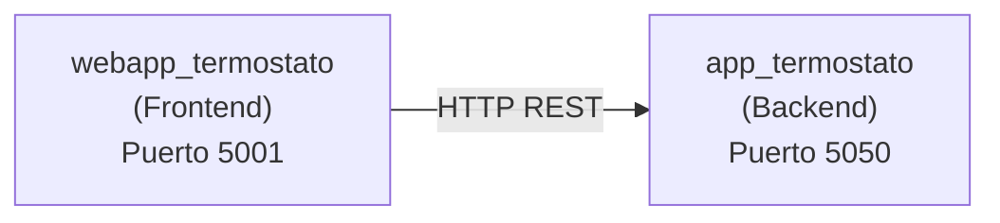

# App Termostato - API REST


API REST Flask para gestion de un termostato. Actua como backend proveyendo datos al frontend `webapp_termostato`.

**🚀 Despliegue en Google Cloud Platform:**
- **Backend (API):** https://app-termostato-1090421346746.us-central1.run.app/
- **Frontend (Web):** https://webapp-termostato-1090421346746.us-central1.run.app/

## Novedades v1.2.0

- **Indicador de bateria automatico**: El indicador se calcula dinamicamente segun el nivel de bateria (NORMAL/BAJO/CRITICO)
- Umbrales de bateria configurables por variables de entorno
- 62 tests automatizados (35 unitarios + 27 integracion)
- Grado de calidad A (CC=1.75, MI=92.21, Pylint=8.41)

## Descripcion

Este proyecto es parte de un caso de estudio academico/didactico que demuestra la arquitectura cliente-servidor con separacion de frontend y backend.

La API gestiona:
- Temperatura ambiente actual
- Temperatura deseada configurada
- Estado del climatizador (encendido/apagado/enfriando/calentando)
- Carga de la bateria
- Indicador de carga del dispositivo
- Historial de temperaturas

## Arquitectura



## Requerimientos

- Python 3.8+
- Flask 3.1+
- Dependencias en `requirements.txt`

## Instalacion

1. Clonar el repositorio:
```bash
git clone <url-del-repositorio>
cd app_termostato
```

2. Crear entorno virtual:
```bash
python -m venv venv
source venv/bin/activate  # En Windows: venv\Scripts\activate
```

3. Instalar dependencias:
```bash
pip install -r requirements.txt
```

## Configuracion

La aplicacion usa variables de entorno para configuracion:

| Variable | Descripcion | Valor por defecto |
|----------|-------------|-------------------|
| `PORT` | Puerto del servidor | `5050` |
| `DEBUG` | Modo debug | `true` |
| `VERSION` | Version de la API | `1.1.0` |
| `TEMPERATURA_AMBIENTE_MIN` | Minimo temperatura ambiente | `0` |
| `TEMPERATURA_AMBIENTE_MAX` | Maximo temperatura ambiente | `50` |
| `TEMPERATURA_DESEADA_MIN` | Minimo temperatura deseada | `15` |
| `TEMPERATURA_DESEADA_MAX` | Maximo temperatura deseada | `30` |
| `CARGA_BATERIA_MIN` | Minimo carga bateria | `0.0` |
| `CARGA_BATERIA_MAX` | Maximo carga bateria | `5.0` |
| `INDICADOR_UMBRAL_NORMAL` | Bateria > este valor = NORMAL | `3.5` |
| `INDICADOR_UMBRAL_BAJO` | Bateria >= este valor = BAJO | `2.5` |

## Ejecucion

```bash
python run.py
```

El servidor estara disponible en: http://localhost:5050

## Despliegue en Google Cloud Platform

La aplicacion esta preparada para desplegarse en **Google Cloud Run**.

### Requisitos previos

1. Cuenta de Google Cloud Platform con facturacion habilitada
2. Google Cloud SDK instalado ([instrucciones](https://cloud.google.com/sdk/docs/install))
3. Autenticacion configurada:
```bash
gcloud auth login
```

### Crear proyecto (primera vez)

```bash
# Crear nuevo proyecto
gcloud projects create app-termostato-2025 --name="App Termostato"

# Configurar como proyecto activo
gcloud config set project app-termostato-2025

# Vincular cuenta de facturacion
gcloud billing accounts list
gcloud billing projects link app-termostato-2025 --billing-account=ID_CUENTA

# Habilitar APIs necesarias
gcloud services enable run.googleapis.com cloudbuild.googleapis.com artifactregistry.googleapis.com
```

### Desplegar

```bash
gcloud run deploy app-termostato \
  --source . \
  --region=us-central1 \
  --allow-unauthenticated \
  --project=app-termostato-2025
```

### URL del servicio

Una vez desplegado, el servicio estara disponible en:
```
https://app-termostato-XXXXXXXXXX.us-central1.run.app
```

### Comandos utiles post-despliegue

```bash
# Ver logs en tiempo real
gcloud run logs read --service=app-termostato --region=us-central1 --project=app-termostato-2025

# Ver estado del servicio
gcloud run services describe app-termostato --region=us-central1 --project=app-termostato-2025

# Listar revisiones
gcloud run revisions list --service=app-termostato --region=us-central1 --project=app-termostato-2025
```

### Despliegue continuo (opcional)

Para configurar despliegue automatico desde GitHub:
1. Ir a [Cloud Run Console](https://console.cloud.google.com/run)
2. Seleccionar el servicio `app-termostato`
3. Clic en "Set up continuous deployment"
4. Conectar repositorio de GitHub y seleccionar rama

## Documentacion Swagger

Accede a la documentacion interactiva en: **http://localhost:5050/docs/**

Desde ahi puedes:
- Ver todos los endpoints documentados
- Probar cada endpoint con "Try it out"
- Ver esquemas de request/response

Especificacion OpenAPI disponible en: `/apispec.json`

## Estructura del Proyecto

```
app_termostato/
├── run.py                      # Punto de entrada
├── requirements.txt            # Dependencias
├── pytest.ini                  # Configuracion pytest
├── app/
│   ├── __init__.py
│   ├── configuracion/
│   │   ├── config.py           # Configuracion por entorno
│   │   └── configurador.py     # Singleton del termostato
│   ├── servicios/
│   │   ├── api.py              # Endpoints REST + Swagger
│   │   └── errors.py           # Manejo de errores
│   ├── general/
│   │   └── termostato.py       # Modelo de datos
│   └── datos/
│       ├── historial.py        # Repositorio historial
│       └── persistidor.py      # Persistencia JSON
├── tests/
│   ├── test_termostato.py      # 33 tests unitarios
│   └── test_api.py             # 27 tests integracion
└── quality/
    ├── scripts/                # Scripts de analisis
    └── reports/                # Reportes de calidad
```

## API Endpoints

### Health Check

| Metodo | Endpoint | Descripcion |
|--------|----------|-------------|
| GET | `/comprueba/` | Estado del sistema con uptime y version |

**Respuesta:**
```json
{
  "status": "ok",
  "version": "1.1.0",
  "uptime_seconds": 3600,
  "timestamp": "2025-12-21T10:30:00"
}
```

### Estado Completo

| Metodo | Endpoint | Descripcion |
|--------|----------|-------------|
| GET | `/termostato/` | Obtiene estado completo del termostato |

**Respuesta:**
```json
{
  "temperatura_ambiente": 20,
  "temperatura_deseada": 24,
  "carga_bateria": 5.0,
  "estado_climatizador": "apagado",
  "indicador": "NORMAL"
}
```

### Historial

| Metodo | Endpoint | Descripcion |
|--------|----------|-------------|
| GET | `/termostato/historial/` | Historial de temperaturas |
| GET | `/termostato/historial/?limite=10` | Ultimos N registros |

**Respuesta:**
```json
{
  "historial": [
    {"temperatura": 25, "timestamp": "2025-12-21T10:30:00"}
  ],
  "total": 15
}
```

### Temperatura Ambiente

| Metodo | Endpoint | Descripcion |
|--------|----------|-------------|
| GET | `/termostato/temperatura_ambiente/` | Obtiene temperatura ambiente |
| POST | `/termostato/temperatura_ambiente/` | Establece temperatura (0-50) |

**POST Request:**
```json
{"ambiente": 25}
```

### Temperatura Deseada

| Metodo | Endpoint | Descripcion |
|--------|----------|-------------|
| GET | `/termostato/temperatura_deseada/` | Obtiene temperatura deseada |
| POST | `/termostato/temperatura_deseada/` | Establece temperatura (15-30) |

**POST Request:**
```json
{"deseada": 22}
```

### Bateria

| Metodo | Endpoint | Descripcion |
|--------|----------|-------------|
| GET | `/termostato/bateria/` | Obtiene carga de bateria |
| POST | `/termostato/bateria/` | Establece carga (0.0-5.0) |

**POST Request:**
```json
{"bateria": 3.5}
```

### Estado Climatizador

| Metodo | Endpoint | Descripcion |
|--------|----------|-------------|
| GET | `/termostato/estado_climatizador/` | Obtiene estado |
| POST | `/termostato/estado_climatizador/` | Establece estado |

**POST Request:**
```json
{"climatizador": "enfriando"}
```

Valores: `apagado`, `encendido`, `enfriando`, `calentando`

### Indicador de Carga (Solo lectura)

| Metodo | Endpoint | Descripcion |
|--------|----------|-------------|
| GET | `/termostato/indicador/` | Obtiene indicador calculado |

El indicador se calcula automaticamente segun el nivel de bateria:

| Carga Bateria | Indicador |
|---------------|-----------|
| > 3.5         | `NORMAL`  |
| >= 2.5 y <= 3.5 | `BAJO`  |
| < 2.5         | `CRITICO` |

Los umbrales son configurables via variables de entorno.

## Codigos de Respuesta

| Codigo | Descripcion |
|--------|-------------|
| 200 | OK - Peticion exitosa |
| 201 | Created - Dato registrado correctamente |
| 400 | Bad Request - Campo faltante o valor fuera de rango |
| 404 | Not Found - Endpoint no encontrado |
| 500 | Internal Server Error - Error del servidor |

## Tests

Ejecutar todos los tests:
```bash
pytest tests/ -v
```

Ejecutar con cobertura:
```bash
pytest tests/ --cov=app --cov-report=term-missing
```

**Estado actual:**
- 62 tests (35 unitarios + 27 integracion)
- 100% cobertura del modelo Termostato

## Calidad de Codigo

Ejecutar analisis de calidad:
```bash
python quality/scripts/calculate_metrics.py app/
```

**Metricas actuales (Grado A):**

| Metrica | Valor | Umbral |
|---------|-------|--------|
| Complejidad (CC) | 1.75 | <= 10 |
| Mantenibilidad (MI) | 92.21 | > 20 |
| Pylint Score | 8.41/10 | >= 8.0 |

## Ejemplos con cURL

```bash
# Health check
curl http://localhost:5050/comprueba/

# Estado completo
curl http://localhost:5050/termostato/

# Historial de temperaturas
curl http://localhost:5050/termostato/historial/?limite=5

# Establecer temperatura ambiente
curl -X POST http://localhost:5050/termostato/temperatura_ambiente/ \
  -H "Content-Type: application/json" \
  -d '{"ambiente": 25}'

# Encender climatizador
curl -X POST http://localhost:5050/termostato/estado_climatizador/ \
  -H "Content-Type: application/json" \
  -d '{"climatizador": "calentando"}'
```

## Changelog

Ver [CHANGELOG.md](CHANGELOG.md) para historial completo de cambios.

## Proyecto Relacionado

Este backend es consumido por:
- **webapp_termostato**: Frontend web que muestra los datos del termostato. Disponible en: https://webapp-termostato-1090421346746.us-central1.run.app/

## Licencia

Proyecto academico/didactico para el curso ISSE.
