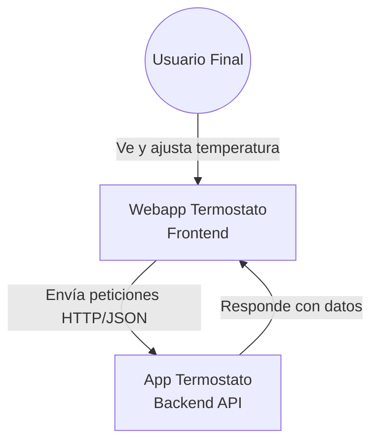
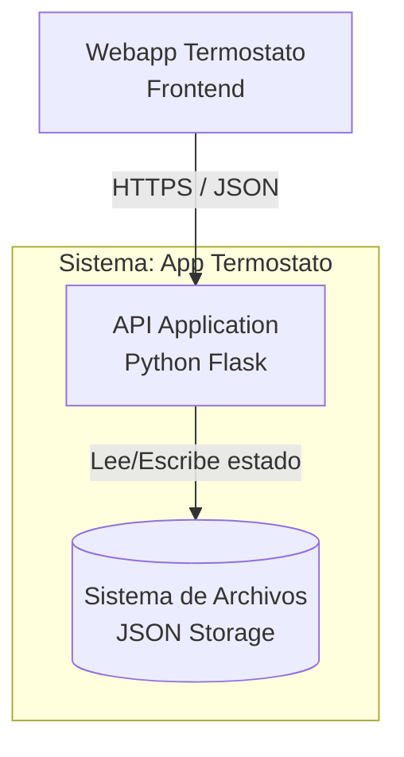
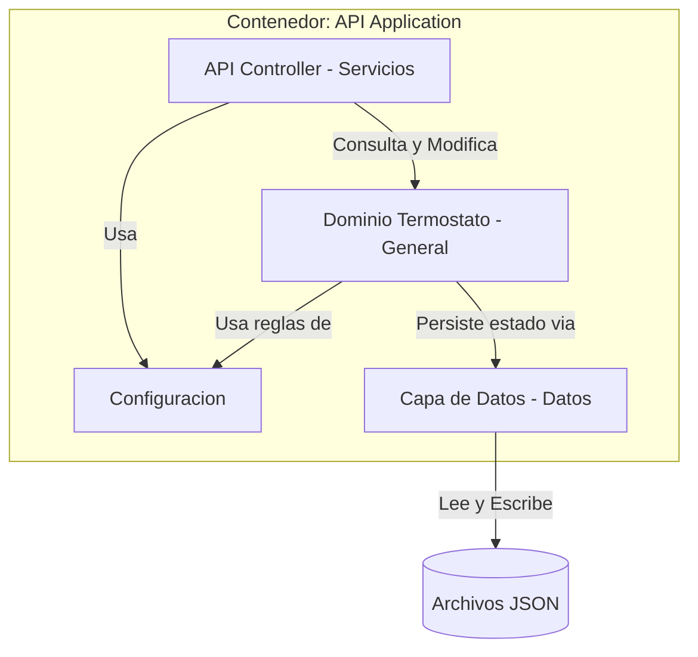
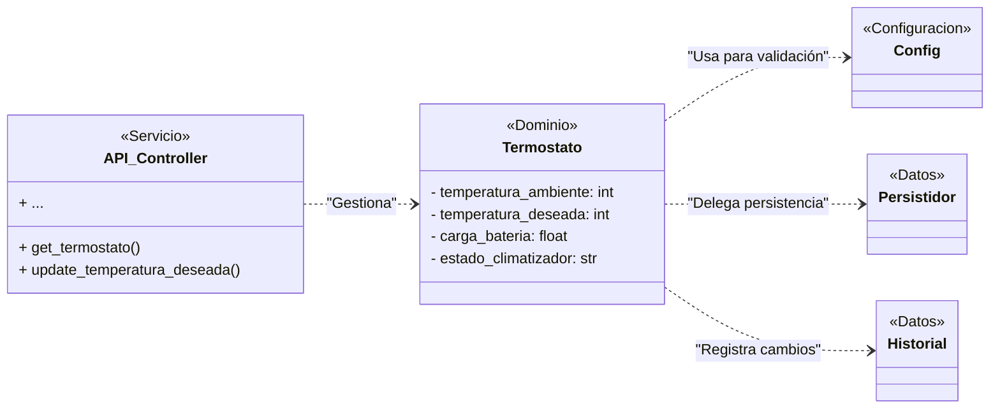

# Especificación de Arquitectura de Software - App Termostato

## 1. Introducción

Este documento describe la arquitectura de software de la aplicación **App Termostato**, un sistema backend diseñado para simular y gestionar un termostato inteligente. El sistema expone una API REST para ser consumida por clientes frontend o dispositivos IoT.

La documentación sigue el modelo C4 (Contexto, Contenedores, Componentes y Código) para ofrecer diferentes niveles de abstracción.

## 2. Nivel 1: Diagrama de Contexto del Sistema

Muestra una visión general de alto nivel, mostrando cómo la API del termostato encaja en su entorno junto a los usuarios y otros sistemas.

## 3. Nivel 2: Diagrama de Contenedores

Se hace zoom en el sistema `App Termostato` para mostrar sus principales bloques de construcción. La aplicación es un monolito ligero construido sobre Python y Flask que utiliza el sistema de archivos local para persistencia.

| Contenedor | Tecnología | Responsabilidad |
|------------|------------|-----------------|
| **API Application** | Python / Flask | Manejo de peticiones HTTP, lógica de negocio y gestión de estado. |
| **File System** | JSON Storage | Persistencia de estado en archivo local (`termostato_estado.json`). |

## 4. Nivel 3: Diagrama de Componentes

Se hace zoom en el contenedor `API Application` para mostrar los componentes internos que lo conforman. La arquitectura interna sigue un diseño por capas con una clara separación de responsabilidades.

### Descripción de Componentes

1.  **API Controller (`app/servicios/`)**
    *   **Responsabilidad**: Punto de entrada HTTP.
    *   **Funciones**: Valida entradas, invoca métodos del dominio y formatea respuestas. Maneja códigos de error HTTP.

2.  **Configuración (`app/configuracion/`)**
    *   **Responsabilidad**: Inicializar la aplicación, inyectar dependencias y asegurar que exista una única instancia de `Termostato` compartida (Singleton/Factory).

3.  **Dominio Termostato (`app/general/`)**
    *   **Responsabilidad**: Corazón del sistema.
    *   **Lógica**:
        *   Validación de rangos (ej. temperatura 0-50°C).
        *   Cálculo de indicador de batería (NORMAL/BAJO/CRITICO).
        *   Gestión de estados del climatizador.

4.  **Capa de Datos (`app/datos/`)**
    *   **Persistidor**: Abstracción para guardar el estado ultimo conocido en disco (JSON).
    *   **Historial**: Almacenamiento en memoria de las lecturas de temperatura.

## 5. Nivel 4: Código y Modelo de Datos

Este nivel se refiere directamente al código fuente. A continuación se detallan las entidades principales y el flujo de datos.

### 5.1 Entidades Principales (Clase `Termostato`)

*   `temperatura_ambiente` (int): Temperatura actual del ambiente.
*   `temperatura_deseada` (int): Temperatura objetivo configurada.
*   `carga_bateria` (float): Nivel de batería (0.0 - 5.0).
*   `estado_climatizador` (string): "apagado", "encendido", "enfriando", "calentando".
*   `indicador` (calculado): "NORMAL", "BAJO", "CRITICO".

### 5.2 Flujo de Datos

1.  El `Termostato` recibe un cambio de estado (ej. cambiar temperatura deseada).
2.  Valida que el valor esté dentro de los rangos definidos en `Config`.
3.  Actualiza su estado interno.
4.  Invoca al `Persistidor` para guardar el snapshot en disco.
5.  Si cambia la temperatura ambiente, se agrega una entrada al `Historial`.

## 6. Despliegue e Infraestructura

### 5.3 Diagrama de Clases

El siguiente diagrama muestra las clases principales del sistema y su interacción, alineándose con el diagrama de componentes.

## 6. Despliegue e Infraestructura

*   **Docker**: La aplicación está contenedorizada para portabilidad.
*   **Google Cloud Run**: Configurada para despliegue serverless, escalando a 0 cuando no hay tráfico.
*   **Variables de Entorno**: Toda la configuración (puertos, límites, umbrales) se inyecta vía variables de entorno (12-Factor App).

## 7. Atributos de Calidad

*   **Mantenibilidad**: Código modular con alto índice de mantenibilidad (>90).
*   **Testabilidad**: Capa de dominio desacoplada de Flask, permitiendo tests unitarios puros.
*   **Configurabilidad**: Umbrales y constantes extraídos a configuración externa.
